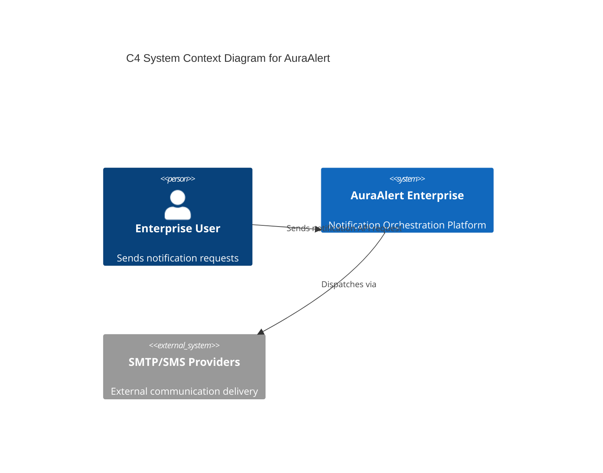

# AuraAlert Enterprise Engineering Handbook & Architectural Specification

## Definitive Solutions Architecture, Corporate Governance Blueprint, and Operations Manual

This handbook represents the official, comprehensive, and unified blueprint, onboarding reference, operations manual, governance framework, and architectural specification for the AuraAlert Enterprise Notification Platform.

---

# PART I: SOLUTIONS ARCHITECTURE & CORE SYSTEM

## Section 1: Executive Summary & System Context
AuraAlert Enterprise v1.0 is a mission-critical notification orchestration platform designed for extreme resilience and high availability. This document defines the operational standards and technical blueprints required to achieve enterprise-grade recovery and service objectives.

## Section 2: Technical Architecture
The AuraAlert architecture is designed for horizontal scalability, high availability, and decoupled service interaction.

# PART II: EXECUTIVE STRATEGY & OWNERSHIP

## Section 3: Product Team Ownership Matrix
To ensure operational accountability, the engineering ownership is divided across product modules.

| Module Name | Technical Owner | Supporting Dev | Business Owner | Status |
| :--- | :--- | :--- | :--- | :--- |
| Auth/IAM | BE Lead | BE Dev 1 | CIO | Complete |
| Orchestration | Platform Eng | BE Dev 2 | COO | Complete |
| Provider Mgmt | Integrations Dev | BE Dev 1 | Operations Dir | Complete |

# PART III: ENGINEERING STANDARDS, GOVERNANCE & SDLC

## Section 4: Coding Standards
- **Naming**: camelCase for variables/functions, UpperCamelCase for classes/types, snake_case for PostgreSQL tables/columns.
- **API Routing**: RESTful, kebab-case, versioned (/api/v1/*).
- **Git Flow**: Strictly enforced feature branching (`feature/*`), Pull Request review, and clean CI builds.

# PART IV: FEATURE INVENTORY & INTERFACE DESIGN

## Feature 1: Authentication & Identity (IAM)
- **Purpose**: Authenticates corporate users, manages roles, and issues JWT tokens.
- **Database Tables**: `users`, `roles`, `permissions`, `role_permissions`.
- **API Endpoints**: 
    - `POST /api/auth/login`
    - `POST /api/auth/logout`

## Feature 2: Orchestration Engine
- **Purpose**: Asynchronous processing, templating, and dispatching notifications.
- **Database Tables**: `notification_logs`, `notification_templates`, `background_jobs`, `providers`.
- **API Endpoints**:
    - `POST /api/notifications/send`

# PART V: OPERATIONAL READINESS & NON-FUNCTIONAL SPECIFICATIONS

## Section 5: Security & Threat Mitigation
- **Rate Limiting**: IP-based rate limiting on all authentication endpoints.
- **Secrets Management**: Server-side injection of credentials via environment variables and managed vaults.

# PART VI: TESTING & ROADMAP

## Section 6: Testing Strategy
- **Vitest**: For unit/integration tests of math utilities and business logic.
- **Supertest**: For API integration tests.

---
*© 2026 Digital Auracle Technologies Ltd. All Rights Reserved. Confidential*
