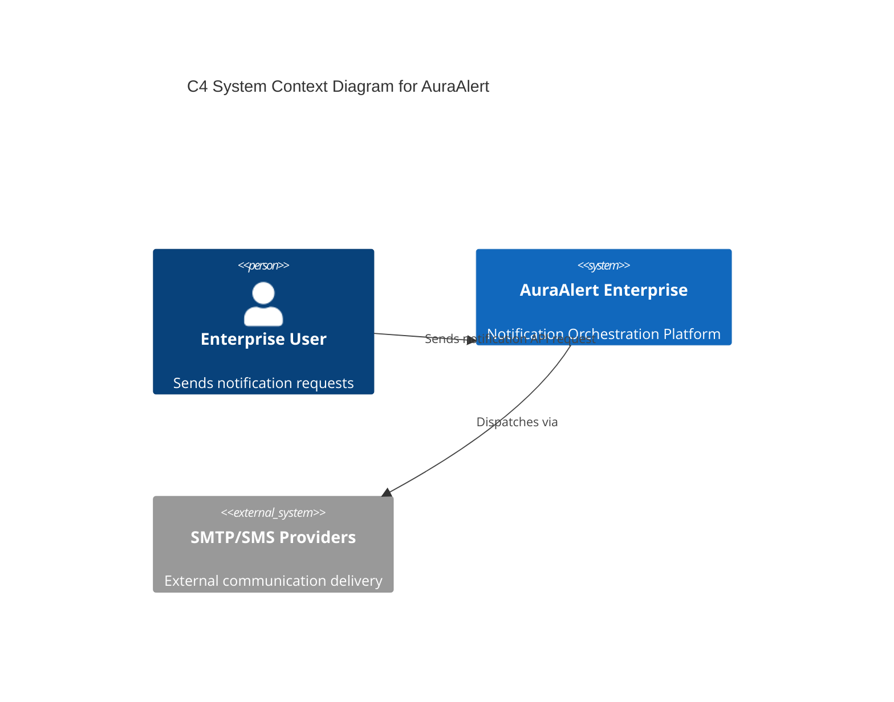
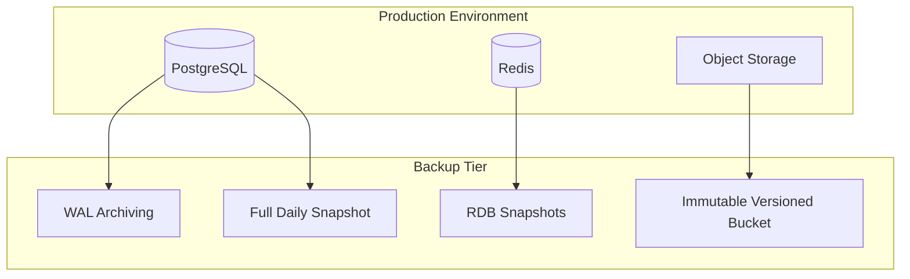
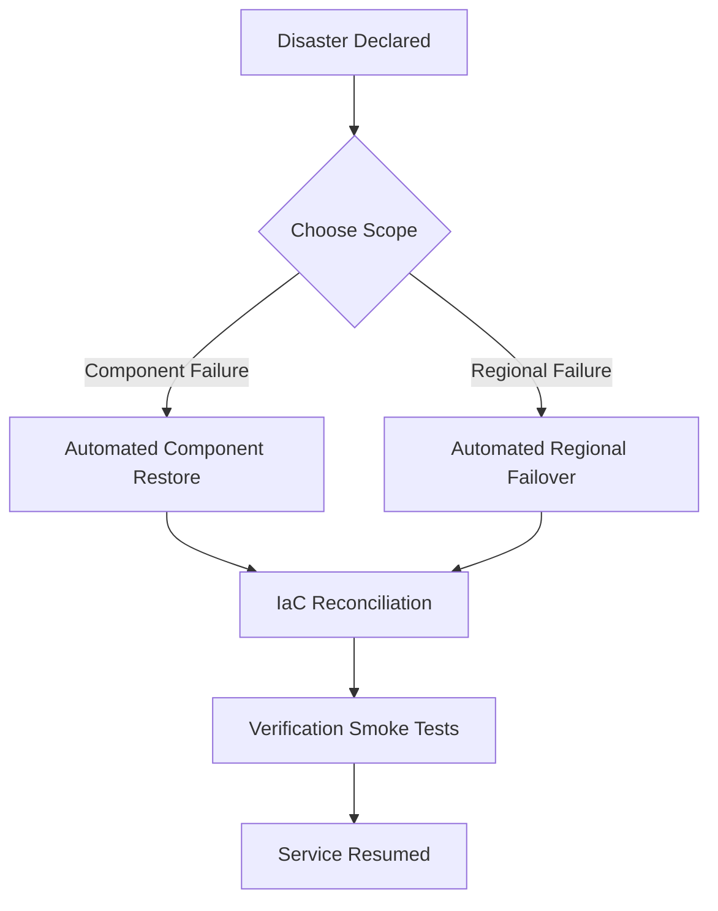
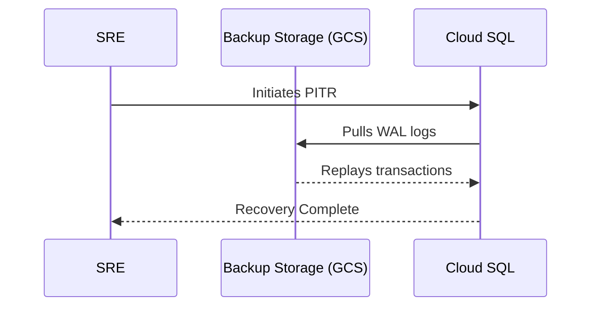
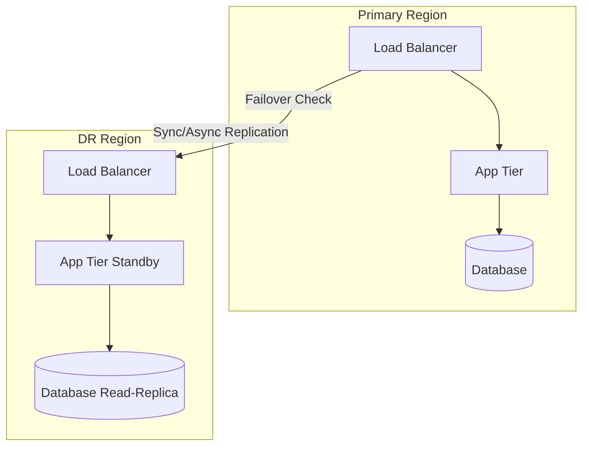
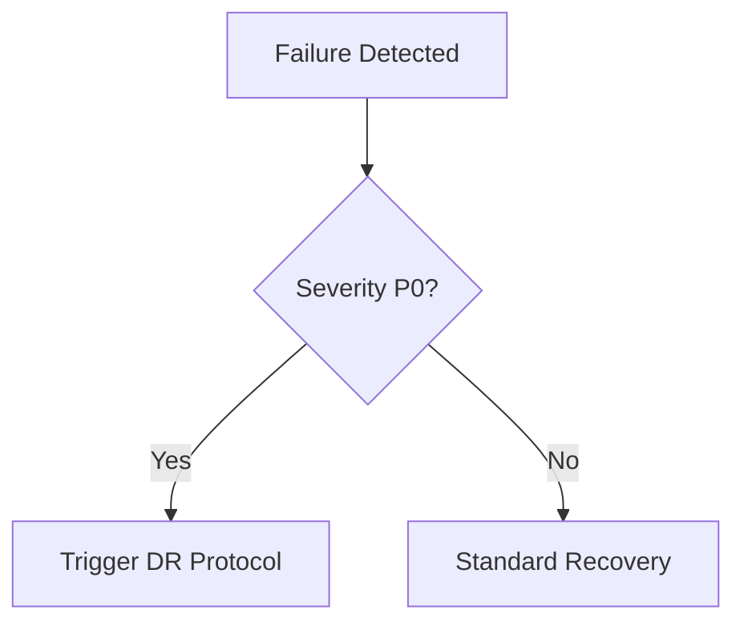

# AuraAlert Enterprise

## Backup & Disaster Recovery Handbook

Version 1.0

Powered by

Auracle Technologies

(Digital Auracle Technologies Ltd)

Prepared by

Theo Desmond N.
Founder
System Architect
Lead Software Engineer

© 2026 Digital Auracle Technologies Ltd.
All Rights Reserved.

---

# Table of Contents
1. Executive Summary
2. Purpose
3. Scope
4. Objectives
5. Definitions
6. Acronyms
7. References
8. System Architecture
9. Backup Architecture
10. Recovery Architecture
11. PostgreSQL Backup
12. Redis Backup
13. Object Storage Backup
14. Vault Backup
15. Secrets Recovery
16. Kubernetes Backup
17. Backup Verification
18. Encryption
19. Retention Policies
20. Geo Replication
21. Disaster Recovery
22. Business Continuity
23. Recovery Procedures
24. RTO
25. RPO
26. Recovery Matrix
27. Recovery Decision Tree
28. Recovery Runbooks
29. Validation
30. Quarterly DR Testing
31. Annual DR Audit
32. Appendices

---

# 1. Executive Summary
AuraAlert Enterprise v1.0 is a mission-critical notification orchestration platform designed for extreme resilience and high availability. Our Backup & Disaster Recovery (DR) strategy is constructed upon the principle of 'resilience-by-design', ensuring that critical notification data—which often contains sensitive, time-sensitive, and regulated communication—is protected against catastrophic infrastructure failure, regional outages, and sophisticated security incidents like ransomware. 

This document formalizes the operational requirements, architecture-specific strategies, and automated recovery procedures essential for maintaining service availability, data integrity, and compliance. AuraAlert Enterprise achieves a Service Level Objective (SLO) of 99.9% availability, with a Recovery Point Objective (RPO) of <15 minutes and a Recovery Time Objective (RTO) of <2 hours. 

The strategy utilizes a multi-layered approach:
- Continuous transactional data protection (PostgreSQL WAL streaming).
- Geo-redundant, immutable storage for all notification assets and logs.
- Automated recovery validation using Infrastructure as Code (IaC) to ensure that restore procedures are tested, not just hypothesized.

This document is the official engineering authority for all Backup and Disaster Recovery operations at Auracle Technologies.

# 2. Purpose
To define the requirements, procedures, and responsibilities for protecting AuraAlert Enterprise data assets and ensuring continuity of operations in the face of catastrophic infrastructure failure.

# 3. Scope
This document covers all production infrastructure components, including databases (PostgreSQL, Redis), object storage, secrets management (Vault), and Kubernetes cluster state for the AuraAlert Enterprise Platform.

# 4. Objectives
- Ensure zero data loss for critical transactional records.
- Minimize RTO (Recovery Time Objective) and RPO (Recovery Point Objective).
- Maintain immutable backups to defend against ransomware.
- Provide automated, repeatable recovery procedures.

# 5. Definitions
- **RTO**: The maximum acceptable length of time that a computer, system, network, or application can be down after the failure of or disaster affecting said system.
- **RPO**: The maximum targeted period in which data might be lost from an IT service due to a major incident.

# 6. Acronyms
- **DR**: Disaster Recovery
- **PITR**: Point-in-Time Recovery
- **WAL**: Write-Ahead Logging
- **SRE**: Site Reliability Engineering

# 7. References
- ISO 27001 Security Standard
- SOC 2 Compliance Requirements
- Auracle Engineering Standards Handbook

# 8. System Architecture
The AuraAlert Enterprise architecture is designed for horizontal scalability and high availability. The system is orchestrated by Kubernetes across multiple availability zones, ensuring no single point of failure within a region.

The system components include:
- **API Layer**: Managed Kubernetes cluster serving high-throughput REST/gRPC endpoints.
- **Database Layer**: Cloud SQL PostgreSQL with high-availability standby replicas.
- **Cache/Queue Layer**: Redis cluster for rapid message queueing and session caching.
- **Storage Layer**: Multi-region, immutable Object Storage (GCS) for persistent logging and asset storage.
- **Security Layer**: HashiCorp Vault for centralized secret and key management.

# 9. Backup Architecture
AuraAlert adheres to the industry-standard "3-2-1-1-0" backup rule to ensure maximum data durability: 3 copies of data, 2 different media types, 1 offsite copy, 1 immutable copy, and 0 errors in restoration.

Our tiered strategy comprises:
- **Tier 1 (Hot/Operational)**: Real-time synchronous database replication to standby nodes.
- **Tier 2 (Warm/Backup)**: Continuous WAL streaming for PostgreSQL and automated snapshots for Redis and Object Storage.
- **Tier 3 (Cold/Archive)**: Long-term off-site replication to immutable, versioned object storage buckets, protected by WORM (Write-Once-Read-Many) policies to defend against ransomware.

# 10. Recovery Architecture
Recovery is treated as a first-class citizen in the AuraAlert Engineering lifecycle. Our architecture is designed for "infrastructure-as-code-driven" recovery, ensuring that the entire environment can be rebuilt from source control with zero manual configuration.

Key recovery principles:
- **Declarative State**: Kubernetes manifests and Terraform scripts define the desired state of the entire platform.
- **Automated Reconciliation**: Controllers continuously monitor and enforce the desired state, automatically re-provisioning failed components.
- **Data-First Recovery**: Database and object storage volumes are recovered *before* application tier pods are instantiated to ensure consistency.

# 11. PostgreSQL Backup
PostgreSQL is the system of record. We utilize Cloud SQL managed PostgreSQL features combined with automated pgBackRest for advanced recovery scenarios.

## Backup Strategy
- **Full Backups**: Executed every 24 hours at 00:00 UTC. 
- **WAL Archiving**: Continuous streaming of Write-Ahead Logs to a GCS bucket with immutable versioning.
- **RPO Impact**: This configuration enables Point-in-Time Recovery (PITR) with an RPO of <15 minutes (our target is <5 minutes under normal load).

## Restoration Procedure

- **Validation**: Every restore is validated against a secondary test environment using automated scripts to verify data integrity (checksum verification).

# 12. Redis Backup
Redis is deployed in a high-availability cluster configuration.
- **RDB (Redis Database Backup)**: Snapshotting is configured to run every 4 hours, generating point-in-time snapshots to facilitate rapid cluster restoration.
- **AOF (Append Only File)**: Persistence is enabled with `appendfsync everysec` to balance performance and durability, providing a secondary layer of data recovery.
- **Cluster Recovery**: In the event of node failure, the Redis Sentinel / Cluster manager automatically promotes a replica to master. Full cluster restoration requires pulling the latest RDB from GCS and re-syncing the cluster nodes.
- **Monitoring**: Sentinel/Cluster health is monitored via Prometheus. Critical alerts trigger if replica lag exceeds 100ms.

# 13. Object Storage Backup
We utilize multi-region GCS buckets with the following enterprise features:
- **Versioning**: Enabled globally to allow restoration of accidentally deleted or overwritten objects.
- **Cross-Region Replication (CRR)**: Critical buckets are replicated to a geographically distant region (e.g., `us-east1` to `europe-west1`) for protection against regional outages.
- **Lifecycle Management**: Objects are automatically moved to Coldline/Archive storage classes after 30 days to optimize costs, and permanent deletion is only permitted after 1 year.
- **Encryption**: Customer-Managed Encryption Keys (CMEK) via Google KMS ensures data is unreadable by unauthorized entities, even with storage-level access.

# 14. Vault Backup
HashiCorp Vault is the backbone of our security architecture, requiring absolute data integrity.
- **Raft Storage**: Vault uses internal Raft consensus for state. Snapshots are taken hourly.
- **Snapshot Storage**: Snapshots are encrypted and pushed to a hardened, dedicated GCS bucket with strict IAM controls.
- **Automated Restoration**: Vault provides native tools (`vault operator raft snapshot restore`) to rebuild the cluster from a snapshot.

# 15. Secrets Recovery
- **Unseal Process**: We employ Shamir's Secret Sharing (via auto-unseal with Cloud KMS). In the event of a total master key loss, recovery keys must be combined using a quorum (n of m) of designated security officers.
- **Key Rotation**: Master keys are automatically rotated quarterly.
- **Emergency Access**: Procedures are documented for emergency recovery in `RUNBOOKS.md`.

# 16. Kubernetes Backup
We use **Velero** for cluster-level backup and recovery.
- **Cluster State**: Velero performs automated snapshots of `etcd` and Kubernetes API objects (Deployments, Services, ConfigMaps, Secrets, PVCs).
- **Persistent Volumes (PV)**: Snapshots of PVCs are taken via the Cloud Provider's snapshot API, integrated directly with Velero.
- **Restore Procedure**: 
  1. Initialize target cluster.
  2. Install Velero and configure snapshot access.
  3. `velero restore create --from-backup <backup-name>`.
- **Validation**: Monthly automated restores into a sandbox cluster to verify PVC attachment and service health.

# 17. Backup Verification
- Weekly automated restore tests.
- Checksum validation of restored data against source.

# 18. Encryption
- All backups encrypted at rest using AES-256 with customer-managed keys (CMK).

# 19. Retention Policies
| Component | Retention |
| :--- | :--- |
| PostgreSQL | 30 Days |
| Redis | 7 Days |
| Object Storage | Indefinite |

# 20. Geo Replication
- All critical storage volumes are replicated to a secondary region.

# 21. Disaster Recovery
AuraAlert Enterprise utilizes a "warm-standby" Disaster Recovery (DR) model, ensuring that a fully functional secondary region can assume the traffic load of the primary region within 2 hours.

- **Failover Trigger**: Initiated upon P0 monitoring alerts (e.g., region-wide network failure, Cloud provider API unavailability).
- **Failover Procedure**:
  1. DNS update (via Cloud Load Balancing) to point traffic to secondary region.
  2. Database standby promotion (PostgreSQL HA promotion).
  3. App tier scaling (HPA triggers auto-scaling).

# 22. Business Continuity
Our Business Continuity Plan (BCP) is designed to ensure organizational resilience.
- **Scope**: Covers personnel, physical infrastructure, and service delivery.
- **Activation**: BCP is activated by the Incident Commander during prolonged service outages.
- **Communication Plan**: Automated customer updates via status page (status.auraalert.io) and direct email alerts from the communication templates found in `RUNBOOKS.md`.

# 23. Recovery Procedures
Recovery is categorized into automated runbooks (documented in `RUNBOOKS.md`) and manual intervention protocols for catastrophic events.

# 24. RTO (Recovery Time Objective)
The target for AuraAlert Enterprise is an RTO of **< 2 hours**.
- **Calculation**: Includes detection time + failover trigger + infrastructure provisioning + data reconciliation + smoke testing.

# 25. RPO (Recovery Point Objective)
The target for AuraAlert Enterprise is an RPO of **< 15 minutes**.
- **Calculation**: Defined by the duration of WAL logs streaming and RDB/Snapshot frequency. Continuous WAL streaming makes our actual RPO significantly lower (seconds).

# 26. Recovery Matrix
| Failure Type | Recovery Component | RTO | RPO |
| :--- | :--- | :--- | :--- |
| Database Failure | PostgreSQL | 15 mins | 0 (Sync replica) |
| Regional Failure | Entire Infrastructure | 2 hours | 5 mins |
| Object Storage Corruption | GCS Versioning | 30 mins | 0 |
| Ransomware | Immutable Backups | 1 hour | 1 hour |

# 27. Recovery Decision Tree

# 28. Recovery Runbooks
- Located in `/governance/RUNBOOKS.md`.

# 29. Validation
- Automated smoke tests post-recovery.

# 30. Quarterly DR Testing
- Mandatory simulation of regional failure.

# 31. Annual DR Audit
- Review by internal audit and security teams.

# 32. Appendices
- Script library references.
- Contact escalation lists.

