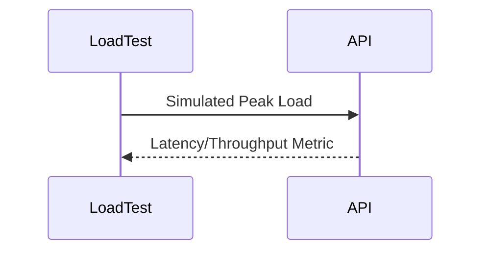

# AuraAlert Enterprise

## Capacity Planning Handbook

Version 1.0

Powered by

Auracle Technologies

(Digital Auracle Technologies Ltd)

Prepared by

Theo Desmond N.
Founder
System Architect
Lead Software Engineer

© 2026 Digital Auracle Technologies Ltd.
All Rights Reserved.

---

# Table of Contents
1. Executive Summary
2. Forecasting Models
3. Growth Metrics
4. Traffic Modeling
5. Queue Capacity Planning
6. Worker Scaling Strategy
7. Database Scaling
8. Redis Scaling
9. Storage Planning
10. Bandwidth Planning
11. Cost Forecasting
12. CPU Planning
13. Memory Planning
14. Autoscale Models
15. Performance Targets
16. Benchmark Methodology

# 1. Executive Summary
AuraAlert Enterprise proactively manages infrastructure capacity to meet growing demand while optimizing resource utilization and cost. This manual defines our methodologies for traffic modeling, scaling triggers, and performance benchmarking, ensuring the platform remains highly available and performant under load.

# 2. Forecasting Models
AuraAlert uses time-series forecasting to predict future infrastructure requirements based on historical data.

# 3. Growth Metrics
We track KPIs such as Requests per Second (RPS) and active notification channels to forecast growth.

# 4. Traffic Modeling
Traffic is modeled to predict peak loads and ensure the system can handle bursts.

```mermaid
xyChart-beta
    title "Projected Traffic Growth (Req/s)"
    x-axis [Q1, Q2, Q3, Q4]
    y-axis "Requests per Second" 0 --> 50000
    line [10000, 20000, 35000, 48000]
```

# 6. Worker Scaling Strategy
We utilize Kubernetes HPA to dynamically scale worker pods.

| Metric | Target |
| :--- | :--- |
| CPU Utilization | 70% |
| Queue Depth | < 100 |

# 16. Benchmark Methodology
Performance is verified through automated load testing.



---
*AuraAlert Enterprise v1.0*
*© 2026 Digital Auracle Technologies Ltd. All Rights Reserved. Confidential*

