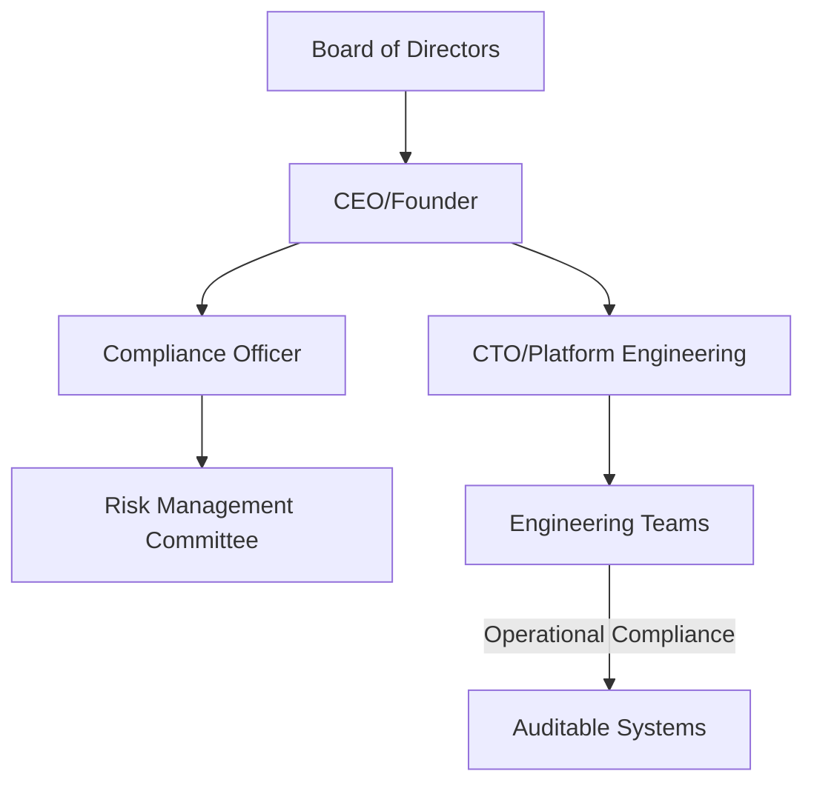
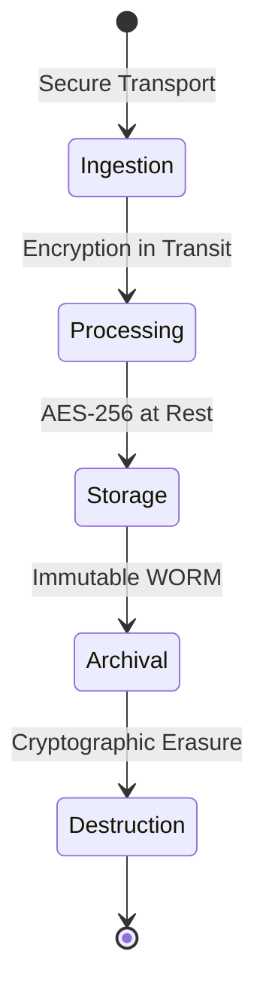

# AuraAlert Enterprise

## Compliance & Security Manual

Version 1.0

Powered by

Auracle Technologies

(Digital Auracle Technologies Ltd)

Prepared by

Theo Desmond N.
Founder
System Architect
Lead Software Engineer

© 2026 Digital Auracle Technologies Ltd.
All Rights Reserved.

---

# Table of Contents
1. Executive Summary
2. Governance Framework
3. SOC 2 Compliance
4. ISO 27001 Alignment
5. GDPR & Data Privacy
6. HIPAA Readiness
7. PCI DSS Considerations
8. Data Classification
9. Data Lifecycle
10. Encryption Standards
11. Access Control
12. RBAC/PBAC Models
13. Secrets Management
14. Audit Logging
15. Secure SDLC
16. Vulnerability Management
17. Patch Management
18. Vendor Risk
19. Third-Party Risk
20. Internal Audits
21. External Audits
22. Compliance Checklists
23. Evidence Collection
24. Risk Register
25. Policy Mapping

# 1. Executive Summary
AuraAlert Enterprise is built upon a foundation of compliance-by-design. We adhere to rigorous industry standards including SOC 2 Type II, GDPR, and HIPAA to protect user data and ensure service integrity. This manual outlines the policies, controls, and procedures that govern our engineering and operational practices to maintain continuous compliance. Our strategy ensures that security and privacy are integrated into every stage of the development lifecycle, from initial design to production deployment and monitoring.

# 2. Governance Framework
Our governance framework ensures accountability, transparency, and continuous improvement in our compliance posture.

# 3. SOC 2 Compliance
AuraAlert maintains SOC 2 Type II compliance, focusing on Security, Availability, Processing Integrity, Confidentiality, and Privacy. 
- **Control Objectives**: Regular audit cycles, incident tracking, and access management.
- **Reporting**: Annual Type II reports available upon request to qualified stakeholders.

# 8. Data Classification
We classify data into four tiers to apply appropriate security controls:

| Tier | Name | Description | Control Level |
| :--- | :--- | :--- | :--- |
| 1 | Public | Marketing, Documentation | Low |
| 2 | Internal | Internal Memos | Medium |
| 3 | Restricted | User Metadata, Logs | High |
| 4 | Critical | PII, PHI, Secrets | Maximum |

# 9. Data Lifecycle
This lifecycle ensures data is protected throughout its existence.

# 22. Compliance Checklists
Engineering and Operations must adhere to the following checklists to maintain compliance.

| Checklist | Frequency | Task |
| :--- | :--- | :--- |
| Access Review | Monthly | Audit IAM roles/permissions |
| Patch Mgmt | Weekly | Review/Apply critical patches |
| Sec Scan | Daily | Run SAST/DAST/Container scans |
| Backup Audit | Quarterly | Validate DR/Recovery procedures |

# 18. Vendor Risk Management
AuraAlert rigorously vets all third-party providers.
- **Due Diligence**: Mandatory security review of all prospective vendors.
- **Risk Assessment**: Annual review of vendor security posture (SOC2/ISO certs).
- **Contractual Requirements**: Security and Data Processing Agreements (DPA) enforced for all data-handling vendors.

---
*AuraAlert Enterprise v1.0*
*© 2026 Digital Auracle Technologies Ltd. All Rights Reserved. Confidential*
