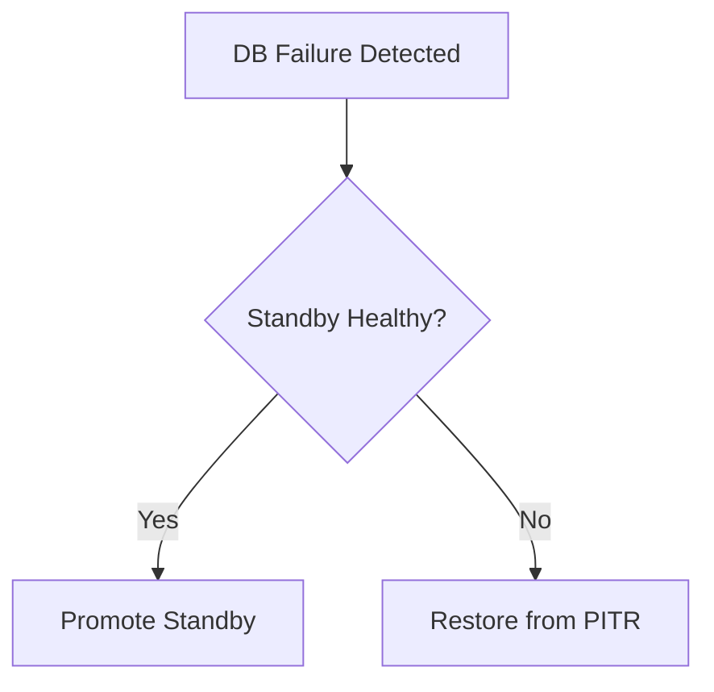

# AuraAlert Enterprise

## On-Call Engineering Handbook

Version 1.0

Powered by

Auracle Technologies

(Digital Auracle Technologies Ltd)

Prepared by

Theo Desmond N.
Founder
System Architect
Lead Software Engineer

© 2026 Digital Auracle Technologies Ltd.
All Rights Reserved.

---

# Table of Contents
1. Executive Summary
2. On-Call Rotation
3. Incident Severity Levels
4. Communication Procedures
5. Incident Diagnosis
6. Incident Containment
7. Incident Recovery
8. PostgreSQL Failure Playbook
9. Redis Failure Playbook
10. Notification Provider Failover
11. Queue Overflow Mitigation
12. Resource Exhaustion (Memory/CPU/Disk)
13. Deployment Rollback
14. Escalation Matrix
15. Post-Mortem Templates
16. Contact Information

# 1. Executive Summary
This handbook serves as the primary operational guide for On-Call Engineers responding to alerts for the AuraAlert Enterprise Platform. It contains the essential procedures, runbooks, and escalation paths needed to diagnose, contain, and recover from service interruptions swiftly, maintaining platform availability and reliability.

# 2. On-Call Rotation
The on-call rotation follows a follow-the-sun model to ensure 24/7 coverage.

| Shift | Timezone | Responsibility |
| :--- | :--- | :--- |
| Americas | PST | Primary Alert Response |
| EMEA | CET | Primary Alert Response |
| APAC | SGT | Primary Alert Response |

# 8. PostgreSQL Failure Playbook
PostgreSQL failures require immediate attention to prevent data loss or outage.

- **Diagnosis**: Run diagnostic script.
  ```bash
  kubectl exec -it <db-pod> -- psql -c "select * from pg_stat_replication;"
  ```
- **Recovery**: If primary is down, promote standby replica.



# 10. Notification Provider Failover
If a primary provider (e.g., SMTP/SMS) experiences latency or failures, traffic is shifted.

- **Trigger**: Error rate > 10% for 5 minutes.
- **Action**: Update environment config via ConfigMap/Vault to point to secondary provider API endpoint.

---
*AuraAlert Enterprise v1.0*
*© 2026 Digital Auracle Technologies Ltd. All Rights Reserved. Confidential*

