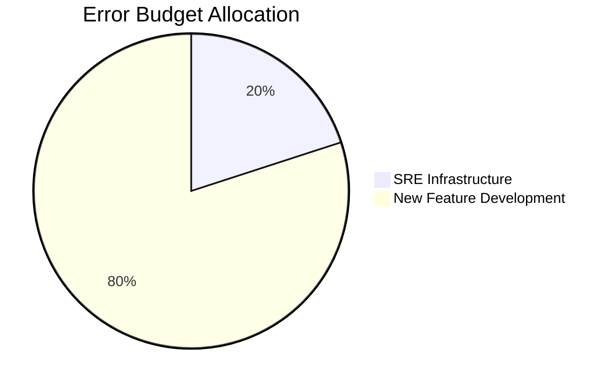

# AuraAlert Enterprise

## SLO & SLA Handbook

Version 1.0

Powered by

Auracle Technologies

(Digital Auracle Technologies Ltd)

Prepared by

Theo Desmond N.
Founder
System Architect
Lead Software Engineer

© 2026 Digital Auracle Technologies Ltd.
All Rights Reserved.

---

# Table of Contents
1. Executive Summary
2. Reliability Targets
3. Service Level Objectives (SLOs)
4. Service Level Indicators (SLIs)
5. Service Level Agreements (SLAs)
6. Error Budget Governance
7. Service Tier Definitions
8. Maintenance Windows
9. Support Levels
10. Escalation Procedures
11. Recovery Time Objectives (RTOs)
12. Recovery Point Objectives (RPOs)
13. Monitoring & Reporting
14. Customer SLAs
15. Internal SLAs

# 1. Executive Summary
AuraAlert Enterprise establishes clear commitments to service reliability and availability for our customers. This document outlines our defined Service Level Objectives (SLOs), Service Level Indicators (SLIs), and Service Level Agreements (SLAs), alongside the operational governance structures (including Error Budget management) required to maintain these targets.

# 2. Reliability Targets
Our reliability targets are defined by component to ensure granular monitoring and alerting.

| Service Component | SLO (Availability) | Latency Target (p95) |
| :--- | :--- | :--- |
| API Gateway | 99.99% | < 50ms |
| Notification Engine | 99.9% | < 200ms |

# 6. Error Budget Governance
Error budgets represent the amount of downtime or unreliability permitted before new feature deployments are halted to prioritize stability.

- **Policy**: When the error budget is exhausted (0%), all new deployments are blocked until stability is restored and the budget recovers.

# 13. Monitoring & Reporting
We provide transparency through automated reporting.
- **Internal**: Real-time dashboards (Grafana).
- **External**: Monthly availability reports published on `status.auraalert.io`.

---
*AuraAlert Enterprise v1.0*
*© 2026 Digital Auracle Technologies Ltd. All Rights Reserved. Confidential*

