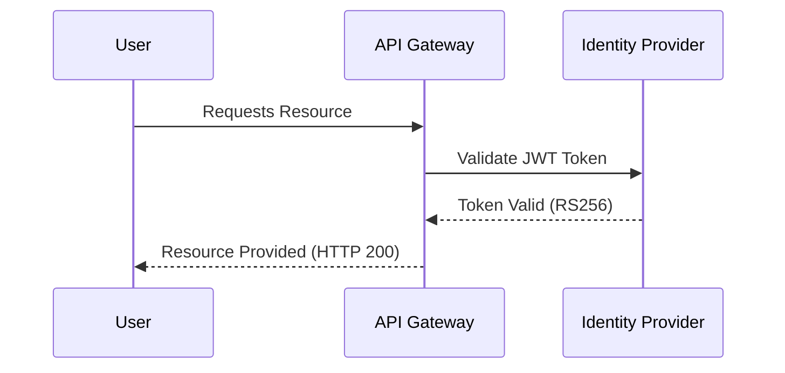
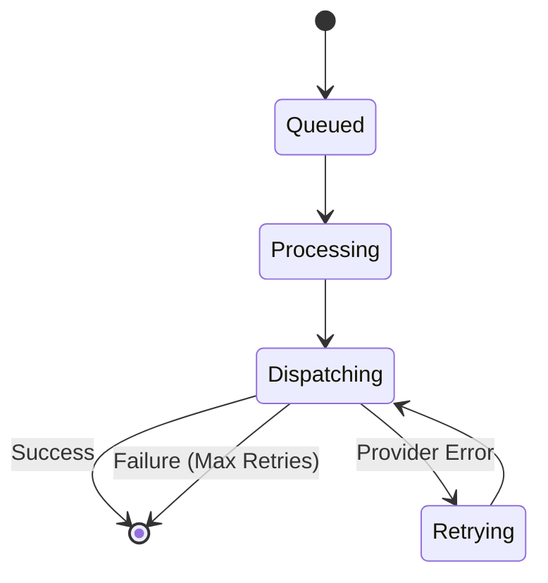

# AuraAlert Enterprise

## Technical Architecture & System Reference

Version 1.0

Powered by

Auracle Technologies

(Digital Auracle Technologies Ltd)

Prepared by

Theo Desmond N.
Founder
System Architect
Lead Software Engineer

© 2026 Digital Auracle Technologies Ltd.
All Rights Reserved.

---

# Table of Contents
1. Executive Summary
2. System Overview & Architecture
3. Authentication & Identity Management
4. API Gateway & Request Flow
5. Notification Orchestration Engine
6. Data Persistence Layer
7. Caching & Queueing
8. Infrastructure & CI/CD
9. Security & Secrets Management
10. Monitoring & Observability
11. Appendix

# 1. Executive Summary
The AuraAlert Enterprise Notification Platform is a high-performance, distributed system designed to deliver mission-critical notifications at scale. This document provides a comprehensive technical breakdown of the architecture, data flows, and technology stack powering AuraAlert Enterprise v1.0. Our architecture focuses on modularity, security, reliability, and observability, ensuring seamless scalability to meet enterprise-grade demands.

# 2. System Overview & Architecture
AuraAlert follows a decoupled, microservices-oriented architecture orchestrated via Kubernetes, emphasizing high availability and horizontal scalability. The system is designed for fault-tolerant operation, ensuring that no single component failure impacts the entire platform.

## Design Principles
- **Decoupling**: Services interact through well-defined APIs and asynchronous message queues.
- **Scalability**: Horizontal pod autoscaling ensures resources match demand.
- **Resilience**: Regional redundancy and data replication protocols.

```mermaid
C4Container
    title AuraAlert Enterprise Container Diagram
    Person(user, "User/Service", "Triggering Notification")
    Container(api, "API Gateway", "Node.js/Express", "Entry point for all requests")
    Container(engine, "Orchestration Engine", "Node.js/Worker", "Processes & dispatches notifications")
    ContainerDb(db, "PostgreSQL", "Cloud SQL", "Stores state, logs, config")
    ContainerDb(cache, "Redis", "Memory Store", "Queues & Session state")
    ContainerExt(vault, "Vault", "HashiCorp", "Secret Management")

    Rel(user, api, "API Calls")
    Rel(api, cache, "Queues job")
    Rel(engine, cache, "Consumes job")
    Rel(engine, db, "Logs state")
    Rel(api, vault, "Fetches provider credentials")
```

# 3. Authentication & Identity Management
AuraAlert enforces rigorous identity and access management standards, utilizing OAuth 2.0 / OIDC protocols to secure platform resources.

## Architectural Components
- **Identity Provider (IdP)**: Centralized authorization server managing user identities and OAuth 2.0 grants.
- **JWT (JSON Web Token)**: Stateless service authentication. Tokens are signed via RS256, containing claims for user ID, organization ID, and scope.
- **Token Lifecycle**: Short-lived access tokens (15 minutes) and long-lived refresh tokens (7 days) with strict rotation and revocation mechanisms.



## Security Standards
- **PKCE**: Enforced for all browser-based authorization flows.
- **Least Privilege**: Scopes strictly define permitted actions per client.

# 4. API Gateway & Request Flow
The API Gateway serves as the centralized entry point, providing unified service discovery, rate limiting, and request routing.

- **Request Lifecycle**: 
    1. TLS Termination (TLS 1.3).
    2. Authentication & JWT Validation.
    3. Rate Limiting (Redis-backed counter).
    4. Payload Schema Validation (Zod).
    5. Routing to downstream orchestration services.

# 5. Notification Orchestration Engine
The core engine is a distributed worker pool processing jobs from the queue.

## Worker Lifecycle
1. **Fetch Job**: Pop notification from Redis queue.
2. **Template Resolution**: Query database for template configuration.
3. **Secret Retrieval**: Fetch provider credentials (SMTP/SMS) from Vault.
4. **Provider Dispatch**: Execute external provider API call.
5. **State Update**: Log success/failure in PostgreSQL, handle retries (Exponential Backoff policy).



# 6. Data Persistence Layer
Cloud SQL (PostgreSQL) is the system of record.

- **Drizzle ORM**: Used for all database interaction, providing type-safe queries and migration management.
- **Schema Design**: Normalized schema to ensure data integrity; indexed critical fields (user_id, organization_id) to maintain query performance at scale.
- **HA**: Synchronous replication across multiple availability zones.

# 7. Caching & Queueing
Redis Cluster provides high-performance, transient state management.

- **Job Queues (BullMQ)**: Implements persistent job queues, allowing worker pods to consume notifications asynchronously.
- **Caching**: Transient data (API rate limits, template caches) stored with appropriate TTL (Time-To-Live).

# 8. Infrastructure & CI/CD
- **Kubernetes (k8s/)**: Platform infrastructure managed as code, ensuring reproducible environment deployment.
- **Terraform**: Infrastructure provisioning (SQL, Redis, GCS, IAM).
- **CI/CD Pipeline**: GitHub Actions pipeline enforcing:
    - Linting & Formatting.
    - Security scanning (SAST/DAST).
    - Automated Unit & Integration tests (`vitest`).
    - Deployment to preview/staging/production environments.

# 9. Security & Secrets Management
- **Vault**: Centralized secret storage. Secrets are never stored in plain text in the repo or environment variables.
- **Injection Pattern**: Secrets are injected into memory at runtime using a sidecar pattern, ensuring they are not persisted on disk.
- **Encryption**: AES-256 for all stored data. TLS 1.3 for all service-to-service communication.

# 10. Monitoring & Observability
- **Metrics**: Prometheus collects custom application metrics, visualized in Grafana (dashboarding performance, queue depth, error rates).
- **Tracing**: OpenTelemetry distributed tracing provides visibility into request paths across services.
- **Logging**: Centralized logs in GCS, indexed for auditability and troubleshooting.

# 11. Appendix
- **Compliance Alignment**: Maps to SOC 2, ISO 27001 (Refer to `COMPLIANCE.md`).
- **Operational Procedures**: Refer to `RUNBOOKS.md` for daily operation guides.

---
*AuraAlert Enterprise v1.0*
*© 2026 Digital Auracle Technologies Ltd. All Rights Reserved. Confidential*
